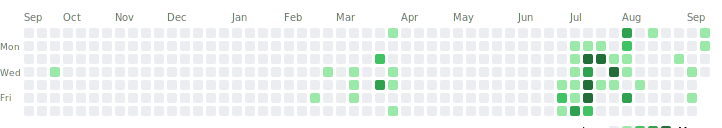

### Hi there, my name is Bruno and I am from Espírito Santo, Brazil

- 🔭 I am currently working on an open-source Costumer Relationship Management software, also known as a CRM
- 🌱 I am also currently taking an electrical engineering course at the [Federal University of the State of Espírito Santo](http://ufes.br/) in Brazil
- 📫 You can reach me at [bruno.blanes@outlook.com](mailto:bruno.blanes@outlook.com) or via my [LinkedIn profile](https://www.linkedin.com/in/BrunoBlanes/)

##### Working on another version of the calendar to show my commits to other branches

	

		
	

	

		

			<a href="https://docs.github.com/articles/why-are-my-contributions-not-showing-up-on-my-profile" class="">Learn how we count contributions</a>.
		

		

			Less
			<ul class="legend">
			<li style="background-color: #ebedf0"></li>
				<li style="background-color: #9be9a8"></li>
				<li style="background-color: #40c463"></li>
				<li style="background-color: #30a14e"></li>
				<li style="background-color: #216e39"></li>
			</ul>
			More
		

	

